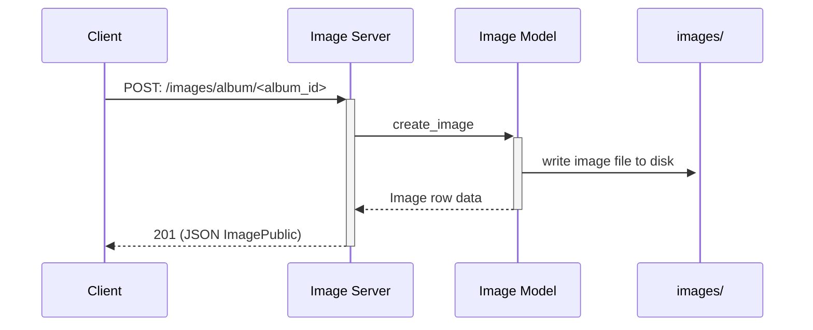
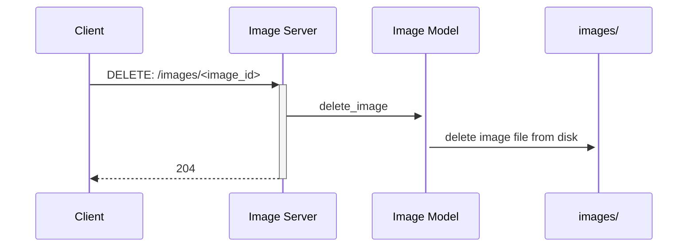
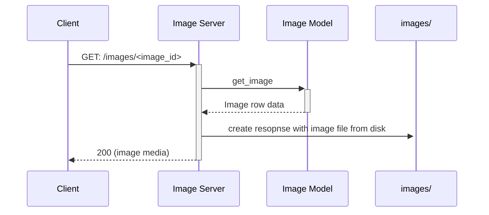
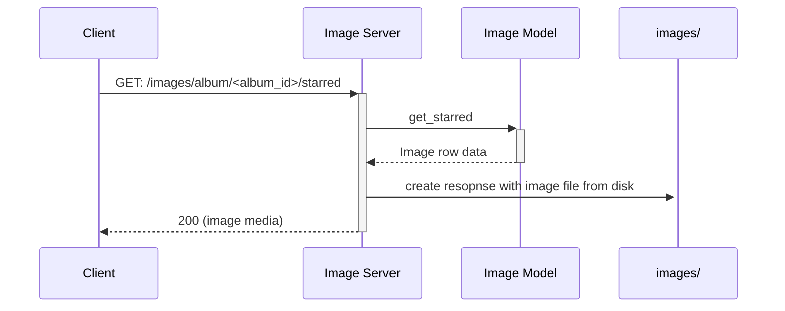
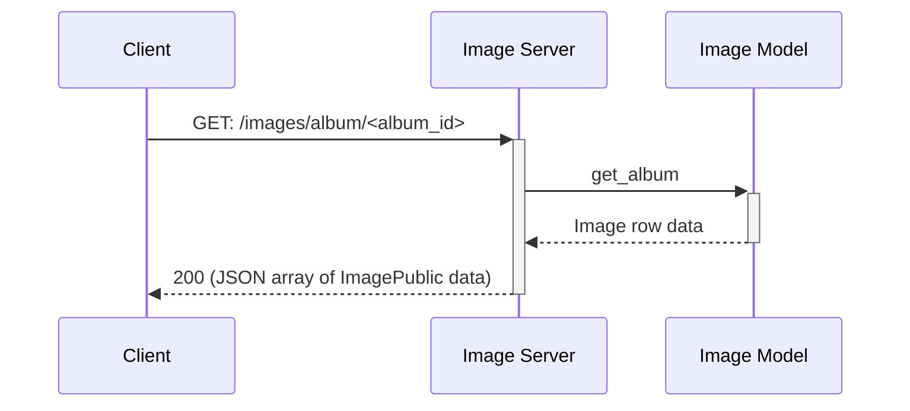
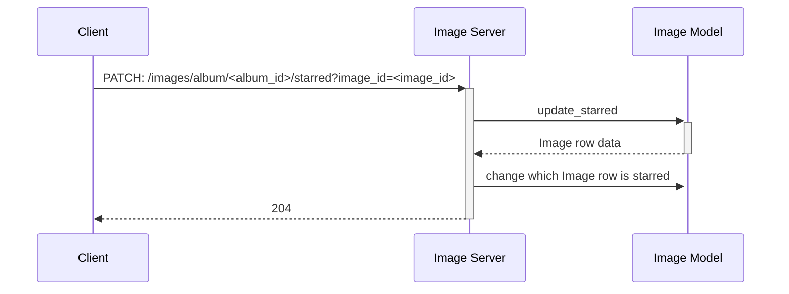

# Image Microservice

A FastAPI microservice for uploading and downloading images organized into albums.

Currently this is only intended for running locally.

## Setup

Create and activate a virtual environment and then install the dependencies.
There are different options to do so, as the dependencies are listed in `pyproject.toml`, `requirements.txt`, and `uv.lock`.
With pip:

```bash
pip install -r requirements.txt
```

With [uv](https://docs.astral.sh/uv/guides/projects/):

```bash
uv sync
```

Next, ensure the listed CORS URLs include the address of whatever client you'll be using to send requests.
These are listed as `str`s in `origins` in `app/main.py` and added to the app's middleware (look for the `app.add_middleware()` function call).

The app uses sqlite, which is part of Python's standard library, so the database will be taken care of by a setup script.

## Usage

To start the service, make sure a virtual environment is active with all dependencies installed, then, from the top-level directory, run:

```bash
fastapi run app/main.py
```

By default, fastapi runs on localhost port 8000.
The port can be set by passing `--port <PORT>` to the above command.

### Communication Contract

#### A Note on Albums

The app stores and serves image files.
These images are associated with an album, which is identified by an integer.
_Albums must be specified by the client._
In other words, the app expects a client to decide which integer to associate with which album as well as to store this information.

#### Adding an image

To upload an image, use the following path and submit the image file as part of a multipart/form-data body with the key `img_upload`.
The API does not discriminate image formats.
It will save any file with a content-type that is an image, such as `image/jpeg` and `image/png`.

**Request**:

- Status code: 201
- method: `POST`
- path: `/images/album/<album_id>`
- body: `multipart/form-data`
  - `img_upload`: content-type: `image/<jpeg|jpg|png|...>`

**Response**:

- Status code: 200
- application/json
- `ImagePublic` schema:
  - "album": integer
  - "starred": boolean
  - "id": int

The response provides the publically available data for the image uploaded.

#### Get all Image data in an album

To retrieve the `ImagePublic` entries for images associated with a particular album:

**Request**:

- method: `GET`
- path: `/images/album/<album_id>`

**Response**:

- application/json
- JSON array of ImagePublic schema:

```json
[
  {
    "album": 1,
    "starred": false,
    "id": 1
  },
  {
    "album": 1,
    "starred": true,
    "id": 2
  }
]
```

#### Retrieve an image file

Images can be retrieved by their `id`, which is the primary key in their SQL database.

**Request**:

- method: `GET`
- path: `/images/<image_id>`

**Response**:

- Status code: 200
- body: an image file
  - `accept-ranges: bytes`
  - `content-type: image/<jpeg|png|...>`

#### Delete an image

An image may be deleted from the server by passing its `id` as a path parameter.

**Request**:

- method: `DELETE`
- path: `/images/<image_id>`

**Response**:

- Status code: 204

#### Get the starred image in an album

To retrieve the image file associated with an album, submit the album `id` as a path parameter.

**Request**:

- method: `GET`
- path: `/images/album/<album_id>/starred`

**Response**:

- Status code: 200
- body: an image file
  - `accept-ranges: bytes`
  - `content-type: image/<jpeg|png|...>`

#### Star an image in an album

To change which image is starred in an album, both the album `id` and the image `id` must be provided.

**Request**:

- method: `PATCH`
- path: `/images/album/{album_id}/starred`
- query parameter: `image_id`

**Response**:

- Status code: 204

### OpenAPI Docs and Manual Testing

To view the automated documentation and try out endpoints, add `/docs` to the URL in your browser.

## How it works

The service saves image files to disk in a directory specified by the `IMAGE_DIR` constant.
This directory is created upon startup if necessary.
A SQLite database is used to store data related to the images.
A row comprises a primary key `id`, an `album` identifier, whether the image is `starred` for its album, and a `filepath` to reference the file.

### POST a new image



### DELETE an image



### GET an image



### GET an album's starred image



### GET all ImagePublic entries in an album



### PATCH an image to be starred in an album



## TODO:

- [x] DELETE endpoint
- [x] Setup documentation
- [x] Document endpoints
  - [x] create image
  - [x] delete image
  - [x] get image
  - [x] get album's starred image
  - [x] get IDs for all images in an album
  - [x] update which image is starred in an album
- [x] UML diagrams
  - [x] create image
  - [x] delete image
  - [x] get image
  - [x] get album's starred image
  - [x] get IDs for all images in an album
  - [x] update which image is starred in an album

### If there's time

- [ ] Modularize `main.py`
- [ ] Assess error handling
- [ ] Tests
- [ ] Move startup functions into an Alembic migration script.
